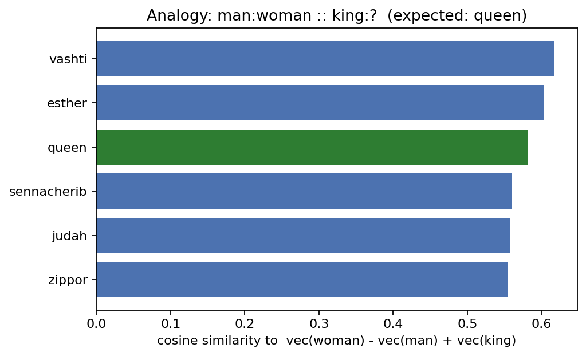
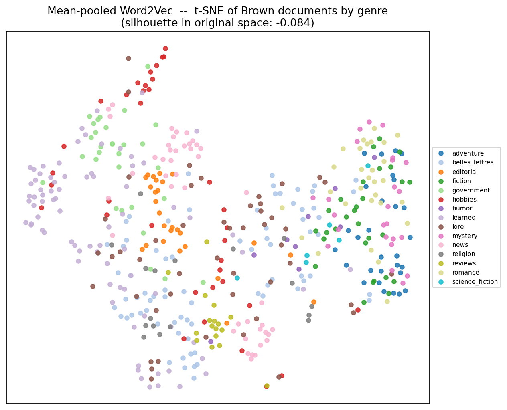
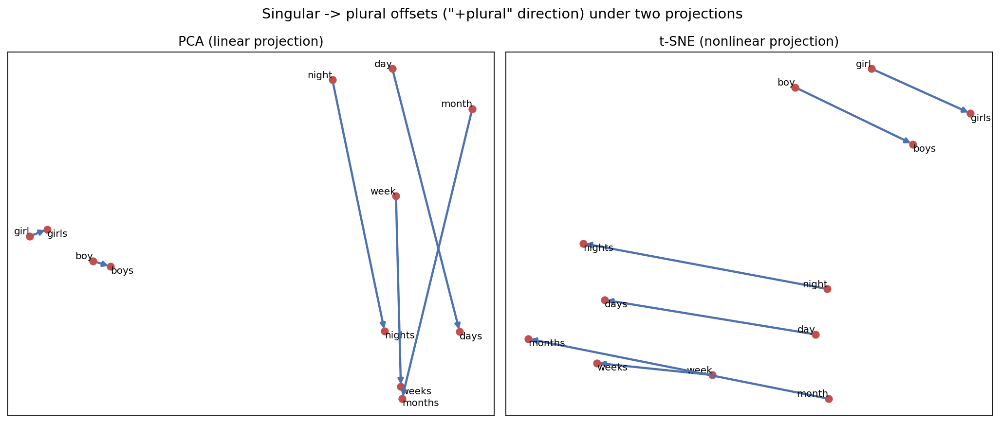
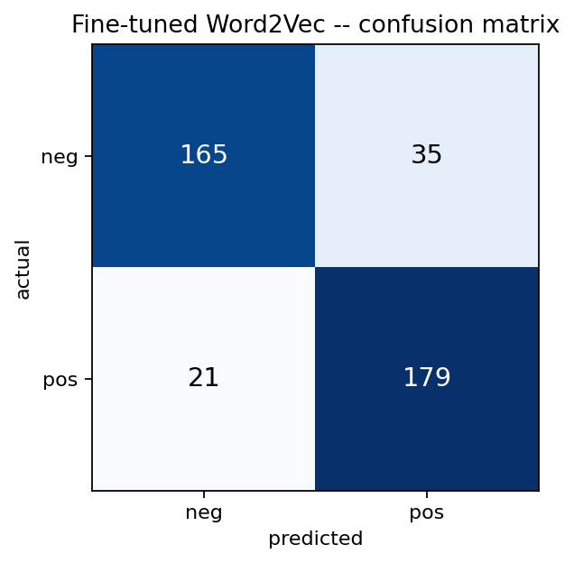

<div align="center">


**Made with ❤️ by [Ayush Kumar Singh](https://github.com/Ayush-2703)**

*Module I of [`Natural_Language_Processing`](../README.md) — a topic-wise, theory-to-implementation*

</div>

---

## Table of Contents

- [Overview](#overview)
- [The Arc of This Phase](#the-arc-of-this-phase)
- [Topics at a Glance](#topics-at-a-glance)
- [Folder Structure](#folder-structure)
- [Datasets Used in This Phase](#datasets-used-in-this-phase)
- [Results Snapshot](#results-snapshot)
- [Highlights Gallery](#highlights-gallery)
- [Getting Started](#getting-started)
- [Key References](#key-references)
- [Navigate](#navigate)
- [License](#license)
- [Author](#author)

---

## Overview

Every downstream idea in this repository — Word2Vec's predictive objective, GloVe's matrix factorization, the RNNs and recursive networks of Phases 4 and 5 — depends on one prior decision: representing a word as a dense vector instead of a one-hot index. Phase 1 is where that decision gets justified, built, evaluated, visualized, put to work, and finally traced down to the computational-graph machinery that makes training any of it possible.

This isn't a scaffold of five empty theory files. Each topic below trains, evaluates, and *reports real numbers* — a Word2Vec model trained from ~4.2M tokens of actual NLTK corpus data, genuine silhouette scores, a measured 16-point accuracy swing between frozen and fine-tuned embeddings, a timed 6× speedup from graph compilation. The [Results Snapshot](#results-snapshot) below pulls those numbers together in one place.

## The Arc of This Phase

The five topics aren't five independent demos — each one either produces or interrogates the same underlying object.

**1.1** builds the object: a real Word2Vec space trained on Brown, Gutenberg, and Movie Reviews, wrapped in a small PyTorch class that does cosine similarity and 3CosAdd analogy-solving as plain tensor ops. Every later topic in this phase reuses *this exact trained model* rather than retraining.

**1.2** asks whether that space is actually any good, using two lenses at once: TF-IDF as a non-neural baseline representation, and t-SNE as a way to look at either space — with silhouette score as the one number in the topic that's trustworthy, computed deliberately in the *original* space rather than the 2D picture.

**1.3** picks at a specific weak point of 1.2's approach: t-SNE has no algebraic reason to preserve the analogy structure (`b - a + c ≈ d`) that 1.1 relied on, while PCA — a linear projection — provably does. The topic runs both side by side on real plural-noun offsets and finds a genuinely more interesting answer than "it works": "+plural" turns out to be several related-but-distinct directions, not one universal vector.

**1.4** stops looking at the space and starts *using* it — mean-pooling the same Word2Vec vectors into a sentiment classifier, then running the single experiment that matters most for transfer learning: does freezing or fine-tuning the pretrained embeddings work better? (The answer is not close.)

**1.5** zooms all the way out from words to ask what actually made 1.1–1.4 trainable at all: the computational-graph abstraction and reverse-mode automatic differentiation that TensorFlow, Theano, and PyTorch's own `.backward()` are each an implementation of.

## Topics at a Glance

| # | Topic | Folder | What it builds |
|---|-------|--------|-----------------|
| 1.1 | Introduction to Vectors and Word Analogy | [`01-Introduction_to_Word_Vectors_and_Analogies`](01-Introduction_to_Word_Vectors_and_Analogies) | A real Word2Vec model (gensim) + a PyTorch cosine-similarity / 3CosAdd analogy solver |
| 1.2 | Assessing Word Vectors using TF-IDF and t-SNE | [`02-Assessing_Word_Vectors_TFIDF_and_tSNE`](02-Assessing_Word_Vectors_TFIDF_and_tSNE) | TF-IDF vectorization, t-SNE projections, and silhouette-score evaluation of both document- and word-level structure |
| 1.3 | Visualizing Data and Analogies | [`03-Visualizing_Embeddings_and_Analogies`](03-Visualizing_Embeddings_and_Analogies) | A standalone interactive 3D PCA embedding projector (Plotly) + a PCA-vs-t-SNE stress test on analogy offsets |
| 1.4 | Text Classification utilizing Word Vectors | [`04-Text_Classification_with_Word_Vectors`](04-Text_Classification_with_Word_Vectors) | A `torch.nn.EmbeddingBag` sentiment classifier, run twice — frozen vs. fine-tuned embeddings |
| 1.5 | Computational Frameworks: TensorFlow and Theano | [`05-Frameworks_TensorFlow_and_Theano`](05-Frameworks_TensorFlow_and_Theano) | A from-scratch logistic regression exposing computational graphs, `tf.GradientTape`, and eager vs. `@tf.function` graph-mode execution |

Each topic folder follows the same four-part pattern: **`README.md`** (theory, built from first principles, with references), **`implementation.py`** (real, runnable, no pseudocode), **`explanation.md`** (a line-by-line walkthrough of that exact code, including the actual results from running it), and an **`Image/`** folder of diagrams and generated plots.

## Folder Structure

```
01-Word_Vectors_and_Basics/
├── README.md                                            (this file)
│
├── 01-Introduction_to_Word_Vectors_and_Analogies/
│   ├── README.md                  — theory: one-hot vs. dense vectors, cosine similarity, 3CosAdd
│   ├── implementation.py          — trains Word2Vec, implements analogy solving as tensor ops
│   ├── explanation.md             — line-by-line walkthrough + the 4/7 top-1, 6/7 top-5 results
│   ├── artifacts/
│   │   └── word2vec_phase1.model  — cached trained model, reused by Topics 1.2 – 1.4
│   └── Image/
│       ├── parallelogram_concept.png
│       ├── analogy_king_queen.png
│       └── similarity_heatmap.png
│
├── 02-Assessing_Word_Vectors_TFIDF_and_tSNE/
│   ├── README.md                  — theory: TF-IDF, t-SNE's two-distribution KL minimization, silhouette score
│   ├── implementation.py
│   ├── explanation.md
│   └── Image/
│       ├── tfidf_worked_example.png
│       ├── tsne_tfidf_by_genre.png
│       ├── tsne_word2vec.png
│       └── word2vec_tsne_by_pos.png
│
├── 03-Visualizing_Embeddings_and_Analogies/
│   ├── README.md                  — theory: why PCA (not t-SNE) preserves additive analogy structure
│   ├── implementation.py
│   ├── explanation.md
│   ├── embedding_projector.html   — standalone interactive 3D Plotly viewer, no server needed
│   └── Image/
│       └── pca_vs_tsne_analogy.png
│
├── 04-Text_Classification_with_Word_Vectors/
│   ├── README.md                  — theory: transfer learning, mean pooling, frozen vs. fine-tuned
│   ├── implementation.py
│   ├── explanation.md
│   └── Image/
│       ├── loss_curves.png
│       ├── confusion_frozen.png
│       └── confusion_finetuned.png
│
└── 05-Frameworks_TensorFlow_and_Theano/
    ├── README.md                  — theory: computational graphs, reverse-mode autodiff, Theano's legacy
    ├── implementation.py
    ├── explanation.md
    └── Image/
        ├── computational_graph_concept.png
        ├── eager_vs_graph_timing.png
        └── loss_curve.png
```

## Datasets Used in This Phase

| Topic | Dataset | Scale | Source |
|-------|---------|-------|--------|
| 1.1 | Custom corpus assembled from NLTK's Brown, Gutenberg, and Movie Reviews | 89,999 pseudo-sentences · 4,241,740 tokens · 29,568-word vocab (`min_count=5`) | `nltk.corpus` |
| 1.2 | Brown corpus, 500 documents across 15 genres (plus the Topic 1.1 Word2Vec model) | 500 documents | `nltk.corpus.brown` |
| 1.3 | The Topic 1.1 Word2Vec vocabulary — 400 most frequent words, 6 curated singular/plural pairs | — | cached `.model` |
| 1.4 | NLTK Movie Reviews corpus, binary sentiment | 2,000 documents | `nltk.corpus.movie_reviews` |
| 1.5 | Hand-rolled toy sentence set, deliberately dependency-free | 30 sentences | synthetic, defined in-script |

All datasets are fetched or generated by each topic's own script on first run — nothing is committed to the repo.

## Results Snapshot

Numbers pulled directly from each topic's `explanation.md`, not aspirational claims:

| Topic | Headline result |
|-------|------------------|
| 1.1 — Analogies | Curated 7-item analogy set: **top-1 = 4/7**, **top-5 = 6/7**. `man:woman::king:?` lands `queen` at rank 3 — a top-5 hit, top-1 miss, edged out by Biblical monarchs from the Gutenberg subcorpus |
| 1.2 — TF-IDF vs. Word2Vec clustering | Silhouette (cosine, original space): TF-IDF by genre **−0.007**, mean-pooled Word2Vec by genre **−0.084**, Word2Vec by POS **−0.027** — each representation surfaces different, equally real structure that a single metric undersells |
| 1.3 — PCA vs. t-SNE on analogy offsets | "+plural" splits into sub-groups rather than one direction: human-noun pairs (`boy→boys`, `girl→girls`) cosine-align at **0.63**; time-unit pairs (`day`, `night`, `week`, `month`) at **0.25–0.50**; cross-group similarity ≈ 0 |
| 1.4 — Frozen vs. fine-tuned embeddings | Frozen Word2Vec + classifier head: **69.8%** validation accuracy. Fine-tuned end-to-end: **86.0%** — a **+16.2 pt** swing, and the first result to beat a TF-IDF baseline |
| 1.5 — Graph-mode vs. eager execution | Toy logistic regression reaches **100%** training accuracy; `@tf.function`-compiled graph mode runs **~6× faster** than identical eager code across 300 training steps |

## Highlights Gallery

<div align="center">

<table>
<tr>
<td width="50%"><br/><sub><b>1.1</b> — the parallelogram model, on real trained vectors</sub></td>
<td width="50%"><br/><sub><b>1.2</b> — t-SNE of mean-pooled Word2Vec vectors, colored by genre</sub></td>
</tr>
<tr>
<td width="50%"><br/><sub><b>1.3</b> — PCA vs. t-SNE, same plural-offset vectors</sub></td>
<td width="50%"><br/><sub><b>1.4</b> — confusion matrix, fine-tuned embeddings (86.0% acc.)</sub></td>
</tr>
</table>

</div>

## Getting Started

This folder assumes the full repository is cloned — Topics 1.2–1.4 load `01-Introduction_to_Word_Vectors_and_Analogies/artifacts/word2vec_phase1.model` by relative path (each script will transparently retrain and re-cache it if that file is missing, so nothing breaks if you only pull this folder, it'll just be slower on first run).

```bash
git clone https://github.com/Ayush-2703/Natural_Language_Processing.git
cd Natural_Language_Processing

python -m venv venv
source venv/bin/activate          # Windows: venv\Scripts\activate

pip install -r requirements.txt
python -c "import nltk; [nltk.download(p) for p in ['punkt', 'brown', 'gutenberg', 'movie_reviews']]"

cd 01-Word_Vectors_and_Basics
```

Run the topics in order the first time — 1.1 trains and caches the Word2Vec model that 1.2–1.4 all depend on:

```bash
cd 01-Introduction_to_Word_Vectors_and_Analogies && python implementation.py && cd ..
cd 02-Assessing_Word_Vectors_TFIDF_and_tSNE && python implementation.py && cd ..
cd 03-Visualizing_Embeddings_and_Analogies && python implementation.py && cd ..   # writes embedding_projector.html
cd 04-Text_Classification_with_Word_Vectors && python implementation.py && cd ..
cd 05-Frameworks_TensorFlow_and_Theano && python implementation.py && cd ..        # no dependency on 1.1's cache
```

Topic 1.3's `embedding_projector.html` is fully self-contained (Plotly is bundled in) — open it directly in any browser to rotate the 3D projection, no server required.

## Key References

**Foundational**
1. Bengio, Y., Ducharme, R., Vincent, P., & Jauvin, C. (2003). *A Neural Probabilistic Language Model.* JMLR, 3, 1137–1155.
2. Firth, J. R. (1957). *A Synopsis of Linguistic Theory, 1930–1955.*

**Topic 1.1 — Analogies**

3. Mikolov, T., Chen, K., Corrado, G., & Dean, J. (2013). *Efficient Estimation of Word Representations in Vector Space.* ICLR Workshop.
4. Levy, O., & Goldberg, Y. (2014). *Linguistic Regularities in Sparse and Explicit Word Representations.* CoNLL.

**Topic 1.2 — TF-IDF and t-SNE**

5. Sparck Jones, K. (1972). *A Statistical Interpretation of Term Specificity and Its Application in Retrieval.* Journal of Documentation.
6. Salton, G., & Buckley, C. (1988). *Term-Weighting Approaches in Automatic Text Retrieval.* Information Processing & Management.
7. van der Maaten, L., & Hinton, G. (2008). *Visualizing Data using t-SNE.* JMLR, 9, 2579–2605.
8. Rousseeuw, P. J. (1987). *Silhouettes: A Graphical Aid to the Interpretation and Validation of Cluster Analysis.* Journal of Computational and Applied Mathematics.
9. Wattenberg, M., Viégas, F., & Johnson, I. (2016). *How to Use t-SNE Effectively.* Distill.

**Topic 1.3 — PCA and Embedding Projectors**

10. Smilkov, D., Thorat, N., Nicholson, C., Reif, E., Viégas, F. B., & Wattenberg, M. (2016). *Embedding Projector: Interactive Visualization and Interpretation of Embeddings.* NeurIPS Workshop on Interpretable ML.
11. Pearson, K. (1901). *On Lines and Planes of Closest Fit to Systems of Points in Space.* Philosophical Magazine.
12. Mikolov, T., Yih, W., & Zweig, G. (2013). *Linguistic Regularities in Continuous Space Word Representations.* NAACL.

**Topic 1.4 — Transfer Learning**

13. Collobert, R., & Weston, J. (2008). *A Unified Architecture for Natural Language Processing.* ICML.
14. Collobert, R., Weston, J., Bottou, L., Karlen, M., Kavukcuoglu, K., & Kuksa, P. (2011). *Natural Language Processing (Almost) from Scratch.* JMLR.
15. Pang, B., Lee, L., & Vaithyanathan, S. (2002). *Thumbs up? Sentiment Classification using Machine Learning Techniques.* EMNLP.

**Topic 1.5 — Computational Frameworks**

16. Bergstra, J., Breuleux, O., Bastien, F., Lamblin, P., Pascanu, R., Desjardins, G., Turian, J., Warde-Farley, D., & Bengio, Y. (2010). *Theano: A CPU and GPU Math Compiler in Python.* SciPy.
17. Abadi, M., et al. (2016). *TensorFlow: A System for Large-Scale Machine Learning.* OSDI.
18. Baydin, A. G., Pearlmutter, B. A., Radul, A. A., & Siskind, J. M. (2018). *Automatic Differentiation in Machine Learning: A Survey.* JMLR, 18, 1–43.
19. Bengio, Y. (2009). *Learning Deep Architectures for AI.* Foundations and Trends in Machine Learning.

Each topic's own `README.md` cites the specific subset relevant to it, with additional context.

## Navigate

⬅ [Repository root](../README.md) · ➡ [Phase 2 — Language Modeling and Neural Networks](../02-Language_Modeling_and_Neural_Networks)

---

<div align="center">


</div>
