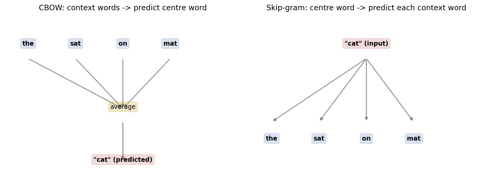
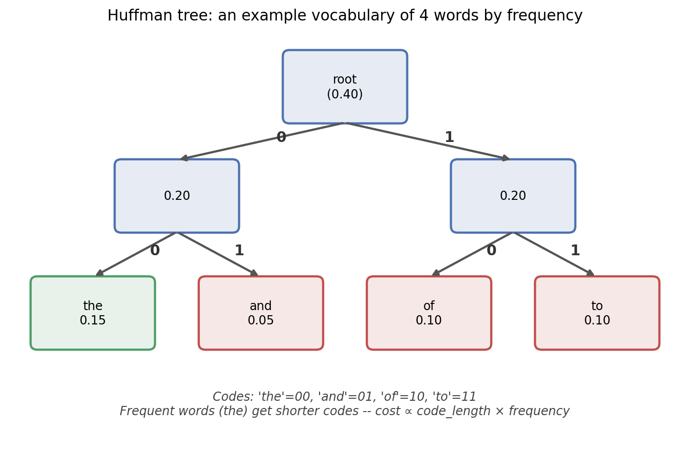
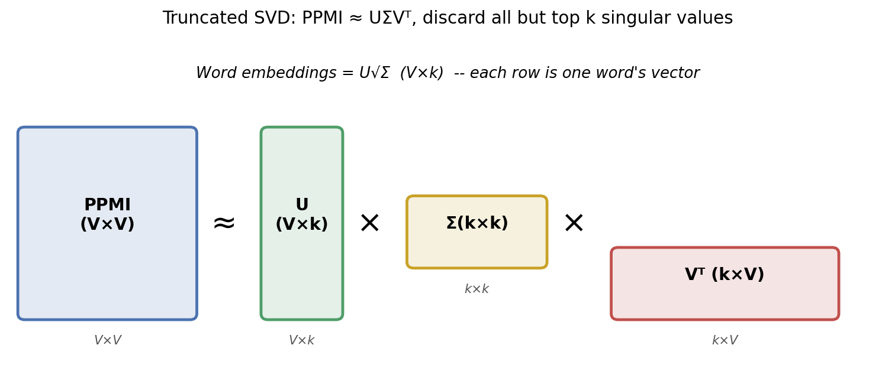
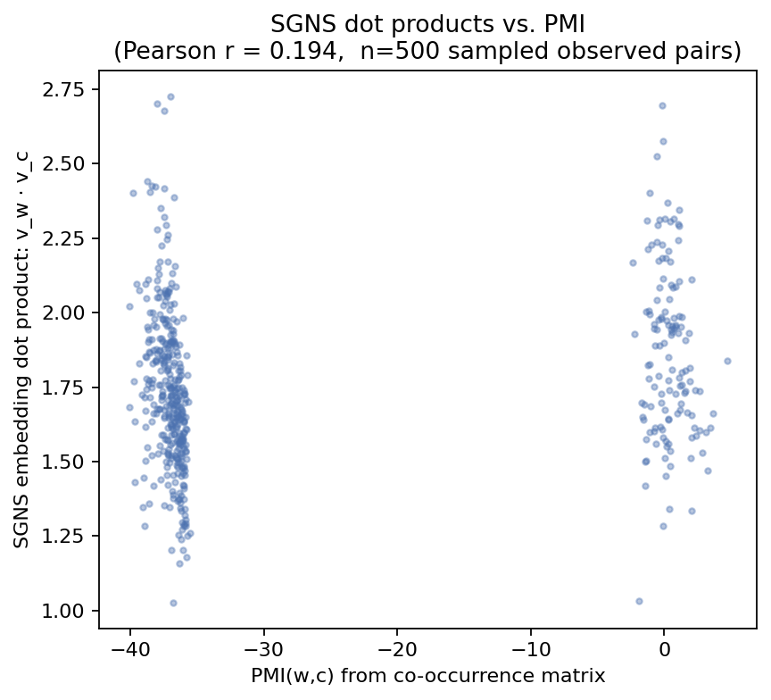

<div align="center">


**Made with ❤️ by [Ayush Kumar Singh](https://github.com/Ayush-2703)**

*[`Natural_Language_Processing`](../README.md) — a topic-wise, theory-to-implementation NLP curriculum*

</div>

---

## Table of Contents

- [Overview](#overview)
- [The Arc of This Phase](#the-arc-of-this-phase)
- [Topics at a Glance](#topics-at-a-glance)
- [Folder Structure](#folder-structure)
- [Datasets Used in This Phase](#datasets-used-in-this-phase)
- [Results Snapshot](#results-snapshot)
- [Highlights Gallery](#highlights-gallery)
- [Getting Started](#getting-started)
- [Known Issues](#known-issues)
- [Key References](#key-references)
- [Navigate](#navigate)
- [License](#license)
- [Author](#author)

---

## Overview

By 2014, word embeddings had split into two camps that looked, on the surface, like competing technologies. One camp trained **predictive** neural models — Word2Vec's CBOW and skip-gram — directly on raw text, one small gradient step at a time. The other camp built a global word–word **co-occurrence matrix** from an entire corpus at once and factorized it with linear algebra — the older tradition PMI and SVD both belong to, and the one GloVe extended. Phase 3 is built around both camps, in that order, and then does something more interesting than just presenting them side by side: it proves, with a real derivation and then a real empirical check, that they were never actually two different ideas.

Topics 3.1–3.3 are the predictive track: CBOW and skip-gram from first principles, the two efficient training tricks (hierarchical softmax, negative sampling) that make training them at scale computationally realistic, and a from-scratch NumPy/TensorFlow implementation with hand-derived, numerically-verified gradients. Topics 3.4–3.7 are the count-based track: building a real co-occurrence matrix, factorizing it via SVD and via Alternating Least Squares, then GloVe as a more carefully-weighted version of the same idea. Sitting between the two tracks, Topic 3.5 derives Levy & Goldberg's (2014) result that skip-gram with negative sampling implicitly factorizes a shifted PMI matrix — and Topic 3.7 closes the loop by computing that PMI matrix directly and checking, on this repository's own trained embeddings, whether the predicted correlation actually shows up (it does — weakly, honestly, and for a well-understood reason).

This phase, like Phase 1, reports real numbers rather than asserting results — timing comparisons run under matched conditions, gradient checks against numerical finite differences, and more than one experiment that didn't fully work as hoped, documented as an honest finding rather than smoothed over. The [Results Snapshot](#results-snapshot) collects them.

## The Arc of This Phase

**3.1** rebuilds Word2Vec as a deliberate simplification of Phase 2's neural language model — no hidden layer, a window that looks both directions — and implements CBOW and skip-gram side by side with a **full softmax**, deliberately capped to a 3,000-word vocabulary to keep that softmax's `O(d·V)` cost tractable to run directly.

**3.2** picks up exactly where 3.1's cost ceiling leaves off: hierarchical softmax (turn one V-way decision into `O(log V)` binary ones, via a Huffman tree that gives frequent words the shortest paths) and negative sampling (skip normalization entirely; train on a handful of sampled negatives instead), benchmarked against full softmax under identical conditions — and against a real, documented failure mode (frequent function words dominating training) that Mikolov et al.'s subsampling only partially fixes at this corpus's scale.

**3.3** removes PyTorch's autograd safety net and implements skip-gram with negative sampling twice more, independently — once in raw NumPy with gradients derived and numerically verified by hand, once in TensorFlow with `tf.GradientTape` — using cross-implementation agreement as a professional-grade correctness check, and documenting a real TF1-optimizer pitfall (`SGD` silently failing to update sparse `IndexedSlices` gradients) along the way.

**3.4** switches tracks entirely: build a real word–word co-occurrence matrix, reweight it with PPMI to correct for frequent words dominating raw counts, and factorize it two ways — truncated SVD, and Alternating Least Squares with a closed-form ridge-regression update at each step.

**3.5** is the hinge of the whole phase: a from-scratch derivation of Levy & Goldberg's (2014) proof that, at the global optimum of the SGNS objective, `v_w · u_c = PMI(w,c) − log k` — meaning Topics 3.1–3.3's predictive training and Topic 3.4's matrix factorization were, mathematically, aiming at the same target all along.

**3.6** makes that unification concrete by implementing GloVe itself — a weighted factorization of the log co-occurrence matrix — two ways (ALS's closed-form per-word ridge regression, and AdaGrad-based gradient descent matching the original paper), and finds the same frequent-word-dominance failure mode as 3.2, for the same underlying reason.

**3.7** closes the loop 3.5 opened: build the actual PMI matrix (and its PPMI, SPPMI, and NPMI variants) directly from the co-occurrence counts, and check empirically whether the trained SGNS embeddings from 3.3 actually correlate with it the way the proof predicts.

## Topics at a Glance

| # | Topic | Folder | What it builds |
|---|-------|--------|-----------------|
| 3.1 | Introduction to Word Embedding (CBOW and Skip-Gram) | [`01-Word_Embeddings_CBOW_and_SkipGram`](01-Word_Embeddings_CBOW_and_SkipGram) | CBOW and skip-gram, full softmax, trained side by side on a shared 3,000-word vocabulary |
| 3.2 | Word2Vec Training Mechanisms: Hierarchical Softmax and Negative Sampling | [`02-Word2Vec_Hierarchical_Softmax_and_Negative_Sampling`](02-Word2Vec_Hierarchical_Softmax_and_Negative_Sampling) | A Huffman-tree hierarchical softmax, negative sampling with a `count^0.75` noise table, and frequent-word subsampling |
| 3.3 | Implementing Word2Vec (NumPy and TensorFlow) | [`03-Implementing_Word2Vec_NumPy_and_TensorFlow`](03-Implementing_Word2Vec_NumPy_and_TensorFlow) | Hand-derived SGNS gradients, a numerical gradient check, and two independent from-scratch implementations |
| 3.4 | Matrix Factorization for Word Representations | [`04-Matrix_Factorization_for_Word_Representations`](04-Matrix_Factorization_for_Word_Representations) | A harmonic-weighted co-occurrence matrix, PPMI reweighting, truncated SVD, and Alternating Least Squares |
| 3.5 | GloVe: Unifying Word2Vec with GloVe | [`05-GloVe_Unifying_Count_and_Predict_Models`](05-GloVe_Unifying_Count_and_Predict_Models) | A from-scratch derivation of Levy & Goldberg's implicit-matrix-factorization proof (theory only — no `implementation.py`) |
| 3.6 | Implementing GloVe using ALS and Gradient Descent | [`06-Implementing_GloVe_ALS_and_Gradient_Descent`](06-Implementing_GloVe_ALS_and_Gradient_Descent) | GloVe's weighted log-co-occurrence objective, solved via closed-form ALS and via AdaGrad |
| 3.7 | Pointwise Mutual Information (PMI) Implementations | [`07-Pointwise_Mutual_Information_PMI`](07-Pointwise_Mutual_Information_PMI) | PMI, PPMI, SPPMI, and NPMI computed directly, plus an empirical check of Topic 3.5's proof against Topic 3.3's trained embeddings |

Each populated topic folder follows Phase 1's four-part pattern: **`README.md`** (theory), **`implementation.py`** (real, runnable code), **`explanation.md`** (a walkthrough of that code with actual results from running it), and an **`Image/`** folder of diagrams and generated plots. Topic 3.5 is the one exception — it's a theory-only topic with no accompanying code.

## Folder Structure

```
03-Embeddings_and_Matrix_Factorization/
├── README.md                                              (this file)
│
├── 01-Word_Embeddings_CBOW_and_SkipGram/
│   ├── README.md              — theory: CBOW vs. skip-gram, the shared full-softmax bottleneck
│   ├── implementation.py      — builds + caches the shared corpus/vocab for Topics 3.2 and 3.3
│   ├── explanation.md
│   ├── artifacts/               (generated on first run — not committed)
│   │   └── word2vec_dataset.pkl
│   └── Image/
│       ├── cbow_vs_skipgram_architecture.png
│       ├── context_window.png
│       ├── full_softmax_cost.png
│       ├── loss_curves.png
│       └── rare_vs_frequent.png
│
├── 02-Word2Vec_Hierarchical_Softmax_and_Negative_Sampling/
│   ├── README.md              — theory: Huffman-tree hierarchical softmax, negative sampling, subsampling
│   ├── implementation.py      — loads Topic 3.1's cached dataset (see Known Issues)
│   ├── explanation.md
│   └── Image/
│       ├── huffman_depth_distribution.png
│       ├── huffman_tree_example.png
│       ├── large_scale_loss.png
│       ├── subsampling_comparison.png
│       └── timing_comparison.png
│
├── 03-Implementing_Word2Vec_NumPy_and_TensorFlow/
│   ├── README.md              — theory: hand-derived SGNS gradients, gradient checking, SGD-vs-Adam pitfall
│   ├── implementation.py      — loads Topic 3.1's cached dataset (see Known Issues)
│   ├── explanation.md
│   └── Image/
│       ├── gradient_check.png
│       └── numpy_vs_tensorflow_loss.png
│
├── 04-Matrix_Factorization_for_Word_Representations/
│   ├── README.md              — theory: co-occurrence matrices, PPMI, SVD, Alternating Least Squares
│   ├── implementation.py      — loads Topic 3.1's cached dataset (see Known Issues)
│   ├── explanation.md
│   ├── artifacts/               (generated on first run — not committed)
│   │   └── cooc_matrix.npy
│   └── Image/
│       ├── als_convergence.png
│       ├── cooc_heatmap.png
│       ├── singular_values.png
│       └── svd_factorisation.png
│
├── 05-GloVe_Unifying_Count_and_Predict_Models/
│   ├── README.md              — theory: the Levy & Goldberg (2014) implicit-factorization proof
│   ├── explanation.md         — how to read the derivation; no implementation.py for this topic
│   └── Image/
│       └── unification_diagram.png
│
├── 06-Implementing_GloVe_ALS_and_Gradient_Descent/
│   ├── README.md              — theory: GloVe's weighted objective, ALS updates, AdaGrad
│   ├── implementation.py      — loads Topics 3.1 & 3.4's cached artifacts (see Known Issues)
│   ├── explanation.md
│   └── Image/
│       ├── analogy_comparison.png
│       └── glove_loss_curves.png
│
└── 07-Pointwise_Mutual_Information_PMI/
    ├── README.md              — theory: PMI / PPMI / SPPMI / NPMI, the empirical Levy–Goldberg check
    ├── implementation.py      — loads Topics 3.1, 3.3 & 3.4's cached artifacts (see Known Issues)
    ├── explanation.md
    └── Image/
        ├── pmi_variants_overview.png
        ├── ppmi_vs_sppmi.png
        ├── ppmi_vs_sppmi_analogy.png
        └── sgns_vs_pmi.png
```

## Datasets Used in This Phase

| Topic | Dataset | Scale | Source |
|-------|---------|-------|--------|
| 3.1 | Custom corpus from NLTK's Brown, Gutenberg, and Movie Reviews — its own phase-local cache and vocabulary, deliberately capped at 3,000 words, independent of Phase 1's copy | 3,000-word vocab | `nltk.corpus` |
| 3.2, 3.3, 3.4, 3.6, 3.7 | The Topic 3.1 cached vocabulary/dataset (and, downstream, the Topic 3.4 co-occurrence matrix) | shared 3,000-word vocab | cached `.pkl` / `.npy` |

The small, capped vocabulary is a deliberate, repeatedly-acknowledged design choice throughout this phase — it's what makes a full softmax (3.1), a from-scratch NumPy implementation (3.3), and a `V×V` co-occurrence matrix (3.4) all tractable to run directly in this repository, at the honestly-documented cost of weaker semantic results than Phase 1's full-corpus, full-epoch gensim model.

## Results Snapshot

Numbers pulled directly from each topic's `explanation.md`:

| Topic | Headline result |
|-------|------------------|
| 3.1 — CBOW vs. skip-gram | CBOW loss **6.62 → 5.36**, skip-gram loss **7.08 → 5.80** over 6 epochs — skip-gram solves the harder task, not a worse one. Frequent-vs-rare-word similarity was essentially flat (**0.483 vs. 0.482**) — far short of the rare-word advantage the literature reports, honestly attributed to only ~6% of a full epoch's skip-gram pairs being used |
| 3.2 — Training-cost comparison | Full softmax **9.63s**, hierarchical softmax **3.42s** (2.82×), negative sampling **1.84s** (5.24×) — real speedups, though far short of the ~500× the raw FLOP-count ratio implies at this small vocabulary, with the gap traced to fixed per-operation overhead |
| 3.2 — Subsampling's limits | Subsampling kept **69.6%** of tokens at `t=1e-3`, verifiably thinning frequent words as designed — but did **not** clean up nearest neighbours at this corpus scale, a documented negative result distinguishing "fixes the imbalance" from "provides enough absolute data" |
| 3.3 — Gradient check | Hand-derived NumPy gradients matched numerical finite differences to **4.10e-11** / **4.32e-11** — float-64 rounding floor, confirming correctness before training proceeded |
| 3.3 — NumPy vs. TensorFlow | NumPy: **217,050 pairs/sec**; TensorFlow: **71,687 pairs/sec** — NumPy 3× faster at this scale, attributed to TF's per-op dispatch overhead. The two independently-trained models' top-10 neighbour sets overlapped by only **1%** — expected, given word-vector space's rotational symmetry |
| 3.4 — SVD/PPMI vs. ALS | SVD/PPMI: **3/4** analogies correct with coherent neighbours; ALS on raw counts: **2/4**, with high-similarity but semantically incoherent neighbours — attributed to ALS here factorizing unweighted counts rather than PPMI |
| 3.6 — GloVe convergence vs. quality | GloVe (AdaGrad) loss dropped cleanly from **0.294 → 0.039** over 8 epochs, yet scored **0/4** on the same analogy set — the same frequent-word-dominance failure mode as Topic 3.2, this time in `f(X_ij)`'s weighting rather than negative sampling |
| 3.7 — The Levy–Goldberg check | SGNS dot products vs. directly-computed PMI values: **r = 0.194** across 500 sampled pairs — clearly positive, confirming the theoretical direction, but weak, honestly attributed to training being far from the global optimum the proof assumes |

## Highlights Gallery

<div align="center">

<table>
<tr>
<td width="50%"><br/><sub><b>3.1</b> — CBOW predicts the centre from context; skip-gram predicts context from the centre</sub></td>
<td width="50%"><br/><sub><b>3.2</b> — the Huffman tree giving frequent words shorter root-to-leaf paths</sub></td>
</tr>
<tr>
<td width="50%"><br/><sub><b>3.4</b> — truncated SVD factorising the PPMI co-occurrence matrix</sub></td>
<td width="50%"><br/><sub><b>3.7</b> — SGNS dot products vs. PMI, r = 0.194, checking Topic 3.5's proof</sub></td>
</tr>
</table>

</div>

## Getting Started

This phase shares repo-wide setup with Phases 1 and 2:

```bash
git clone https://github.com/Ayush-2703/Natural_Language_Processing.git
cd Natural_Language_Processing

python -m venv venv
source venv/bin/activate          # Windows: venv\Scripts\activate

pip install -r requirements.txt
python -c "import nltk; [nltk.download(p) for p in ['punkt', 'brown', 'gutenberg', 'movie_reviews']]"

cd 03-Embeddings_and_Matrix_Factorization
```

Run order matters more here than in Phase 1, because several topics load artifacts a prior topic caches — **see [Known Issues](#known-issues) below before running 3.6 or 3.7**, as their cross-topic paths currently point at pre-rename folder names:

```bash
cd 01-Word_Embeddings_CBOW_and_SkipGram && python implementation.py && cd ..   # builds the shared vocab/dataset cache
cd 02-Word2Vec_Hierarchical_Softmax_and_Negative_Sampling && python implementation.py && cd ..
cd 03-Implementing_Word2Vec_NumPy_and_TensorFlow && python implementation.py && cd ..
cd 04-Matrix_Factorization_for_Word_Representations && python implementation.py && cd ..   # builds the co-occurrence matrix cache
cd 06-Implementing_GloVe_ALS_and_Gradient_Descent && python implementation.py && cd ..      # see Known Issues
cd 07-Pointwise_Mutual_Information_PMI && python implementation.py && cd ..                 # see Known Issues
```

Topic 3.5 has no script to run — read its `README.md` and `explanation.md` for the derivation.

## Known Issues

Two things worth knowing before running this phase end to end, found while documenting it:

- **Broken cross-topic paths in 3.6 and 3.7.** Both hardcode `DATASET_PATH` / `COOC_PATH` / `NUMPY_EMB_PATH` using the phase's old dot-notation folder names (e.g. `"3.1-Word-Embeddings-CBOW-and-SkipGram"`, `"3.4-Matrix-Factorization-for-Word-Representations"`), but the folders were since renamed to the current `01-...`, `03-...`, `04-...` scheme. Neither script has a fallback if the path is missing, so both will raise `FileNotFoundError` as committed. Topics 3.2, 3.3, and 3.4 reference the same old-style path but degrade gracefully (they rebuild the dataset from scratch if the cache isn't found), so only 3.6 and 3.7 are actually broken. Fix: update the three path constants in each file to the current folder names, or symlink the old names to the new ones.
- **`images/` vs. `Image/` casing.** Every `implementation.py` in this phase writes generated plots to a lowercase `images/` folder, while the committed diagrams in this repo all live in a capitalized `Image/` folder. On a case-sensitive filesystem (Linux, GitHub Actions), re-running a script will create a second, separate `images/` folder rather than updating the existing one.

## Key References

**Predictive track (3.1 – 3.3)**

1. Mikolov, T., Chen, K., Corrado, G., & Dean, J. (2013). *Efficient Estimation of Word Representations in Vector Space.* ICLR Workshop.
2. Mikolov, T., Sutskever, I., Chen, K., Corrado, G., & Dean, J. (2013). *Distributed Representations of Words and Phrases and their Compositionality.* NeurIPS.
3. Rong, X. (2014). *word2vec Parameter Learning Explained.* arXiv:1411.2738.
4. Morin, F., & Bengio, Y. (2005). *Hierarchical Probabilistic Neural Network Language Model.* AISTATS.
5. Huffman, D. A. (1952). *A Method for the Construction of Minimum-Redundancy Codes.* Proceedings of the IRE.
6. Goodfellow, I., Bengio, Y., & Courville, A. (2016). *Deep Learning*, Ch. 4.3: Gradient-Based Optimization. MIT Press.
7. Baydin, A. G., Pearlmutter, B. A., Radul, A. A., & Siskind, J. M. (2018). *Automatic Differentiation in Machine Learning: A Survey.* JMLR.

**Count-based track (3.4, 3.6, 3.7)**

8. Church, K. W., & Hanks, P. (1990). *Word Association Norms, Mutual Information, and Lexicography.* Computational Linguistics.
9. Bullinaria, J. A., & Levy, J. P. (2007). *Extracting Semantic Representations from Word Co-occurrence Statistics: A Computational Study.* Behavior Research Methods.
10. Turney, P. D., & Pantel, P. (2010). *From Frequency to Meaning: Vector Space Models of Semantics.* JMLR.
11. Koren, Y., Bell, R., & Volinsky, C. (2009). *Matrix Factorization Techniques for Recommender Systems.* Computer.
12. Duchi, J., Hazan, E., & Singer, Y. (2011). *Adaptive Subgradient Methods for Online Learning and Stochastic Optimization.* JMLR. (AdaGrad.)

**The unification (3.5)**

13. Levy, O., & Goldberg, Y. (2014). *Neural Word Embedding as Implicit Matrix Factorization.* NeurIPS.
14. Pennington, J., Socher, R., & Manning, C. D. (2014). *GloVe: Global Vectors for Word Representation.* EMNLP.

Each topic's own `README.md` cites the specific subset relevant to it, with additional context.

## Navigate

⬅ [Phase 2 — Language Modeling and Neural Networks](../02-Language_Modeling_and_Neural_Networks) · [Repository root](../README.md) · ➡ [Phase 4 — Sequence Tagging and Recurrent Networks](../04-Sequence_Tagging_and_Recurrent_Networks)

---

<div align="center">


</div>
