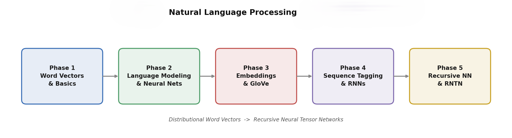

<div align="center">
    


</div>

A complete, topic-wise theory-to-implementation repository for **Natural Language Processing**. Every topic in the curriculum — from the geometry of distributional word vectors to Recursive Neural Tensor Networks — is built out as a self-contained unit with rigorous theory, fully runnable PyTorch/TensorFlow code, a line-by-line explanation of that code, and supporting diagrams.



---

## Table of Contents

- [Overview](#overview)
- [Repository Design Philosophy](#repository-design-philosophy)
- [Full Curriculum](#full-curriculum)
- [Repository Structure](#repository-structure)
- [Datasets Used](#datasets-used)
- [Getting Started](#getting-started)
- [Lab Practicals Mapping](#lab-practicals-mapping)
- [Key References](#key-references)
- [Build Progress](#build-progress)
- [Contributing](#contributing)
- [License](#license)
- [Author](#author)

---

## Overview

The path NLP itself took: from counting and factorizing co-occurrence statistics, to predicting words with shallow neural networks, to recurrent and recursive architectures that respect sequence and syntax. This repository follows that same arc, and three papers anchor its structure rather than sitting as footnotes.

Bengio et al.'s 2003 neural probabilistic language model is the ancestor of everything in Modules II and III — the original argument that a network conditioned on a fixed context window can learn distributed word representations *and* a language model jointly. Collobert & Weston's "almost from scratch" architecture is the case, running through Module IV, for learning general-purpose word representations once and reusing them across POS tagging, NER, and other tasks rather than hand-engineering features per task. And Pennington, Socher & Manning's GloVe paper is the reason Module III is structured as one continuous story — PMI → matrix factorization → Word2Vec → GloVe — instead of four disconnected algorithms; GloVe is explicitly the reconciliation of the count-based and predictive views.

The repository is meant to work equally well as a coursework companion, an interview-prep reference, and a portfolio piece — every implementation here is written to be read, not just run.

## Repository Design Philosophy

Every topic gets its own folder, and every folder contains exactly the same four things.

A `theory.md` builds the mathematical intuition from first principles — derivations, architecture diagrams, and the relevant references — before any code appears. An `implementation.py` (or `notebook.ipynb`, used specifically where the point of the topic is visual, like t-SNE plots or embedding projections) is production-style code: real dataset loading, a real training loop, real evaluation, no pseudocode and nothing "left as an exercise." An `explanation.md` walks through that exact code top to bottom, justifying *why* each tensor operation, loss function, or library call exists — the bridge between the theory file and the code file. And an `images/` folder holds the architecture diagrams and generated plots that the other two files reference.

The intent: read `theory.md` cold, then open `implementation.py` and recognize every line, then open `explanation.md` only for the parts that weren't obvious.

## Full Curriculum

### Phase 1: Word Vectors and Basics (Module I)

| # | Topic | Folder |
|---|-------|--------|
| 1.1 | Introduction to Vectors and Word Analogy | `1.1-Introduction-to-Word-Vectors-and-Analogies` |
| 1.2 | Assessing Word Vectors using TF-IDF and t-SNE Dimensionality Reduction | `1.2-Assessing-Word-Vectors-TFIDF-and-tSNE` |
| 1.3 | Visualizing Data and Analogies (t-SNE, Embedding Projectors) | `1.3-Visualizing-Embeddings-and-Analogies` |
| 1.4 | Text Classification utilizing Word Vectors | `1.4-Text-Classification-with-Word-Vectors` |
| 1.5 | Basics of Computational Frameworks: TensorFlow and Theano | `1.5-Computational-Frameworks-TensorFlow-and-Theano` |

### Phase 2: Language Modeling and Neural Networks (Module II)

| # | Topic | Folder |
|---|-------|--------|
| 2.1 | Introduction to Language Modeling and Neural Networks | `2.1-Introduction-to-Language-Modeling` |
| 2.2 | Bigrams and Language Constructs | `2.2-Bigrams-and-Language-Constructs` |
| 2.3 | Implementation of the Neural Network Bigram Model | `2.3-Neural-Network-Bigram-Model` |

### Phase 3: Deep Word Embeddings and Matrix Factorization (Module III)

| # | Topic | Folder |
|---|-------|--------|
| 3.1 | Introduction to Word Embedding (CBOW and Skip-Gram) | `3.1-Word-Embeddings-CBOW-and-SkipGram` |
| 3.2 | Word2Vec Training: Hierarchical Softmax and Negative Sampling | `3.2-Word2Vec-Hierarchical-Softmax-and-Negative-Sampling` |
| 3.3 | Implementing Word2Vec (NumPy and TensorFlow) | `3.3-Implementing-Word2Vec-NumPy-and-TensorFlow` |
| 3.4 | Matrix Factorization: Introduction, Training, Models, Regularization | `3.4-Matrix-Factorization-for-Word-Representations` |
| 3.5 | Global Vectors (GloVe): Unifying Word2Vec with GloVe | `3.5-GloVe-Unifying-Count-and-Predict-Models` |
| 3.6 | Implementing GloVe using ALS and Gradient Descent | `3.6-Implementing-GloVe-ALS-and-Gradient-Descent` |
| 3.7 | Pointwise Mutual Information (PMI) Implementations | `3.7-Pointwise-Mutual-Information-PMI` |

### Phase 4: Sequence Tagging and Recurrent Networks (Module IV)

| # | Topic | Folder |
|---|-------|--------|
| 4.1 | Introduction to Parts-of-Speech (POS) Tagging | `4.1-Introduction-to-POS-Tagging` |
| 4.2 | Hidden Markov Models (HMM) for POS Tagging | `4.2-Hidden-Markov-Models-for-POS-Tagging` |
| 4.3 | Neural Networks and RNNs applied to POS Tagging | `4.3-RNNs-for-POS-Tagging` |
| 4.4 | NER Basics and NER utilizing RNNs | `4.4-Named-Entity-Recognition-with-RNNs` |

### Phase 5: Recursive Neural Networks and Tree Structures (Module V)

| # | Topic | Folder |
|---|-------|--------|
| 5.1 | Introduction to Recursive Neural Networks | `5.1-Introduction-to-Recursive-Neural-Networks` |
| 5.2 | Parsing Sentences as Trees and Data Description for RNNs | `5.2-Parsing-Sentences-as-Trees` |
| 5.3 | Tree Neural Network (TNN) utilizing Recursion | `5.3-Tree-Neural-Networks-TNN` |
| 5.4 | Converting Trees to Sequences | `5.4-Converting-Trees-to-Sequences` |
| 5.5 | Recursive Neural Tensor Networks (RNTN): Concepts and TensorFlow Implementation | `5.5-Recursive-Neural-Tensor-Networks-RNTN` |

**24 topics across 5 modules**, each shipping the four-part structure described above.

## Repository Structure

```
CSE468-NLP-Deep-Learning/
├── README.md
├── requirements.txt
├── .gitignore
├── assets/
│   └── roadmap-overview.png
│
├── Phase-1-Word-Vectors-and-Basics/
│   ├── 1.1-Introduction-to-Word-Vectors-and-Analogies/
│   │   ├── theory.md
│   │   ├── implementation.py
│   │   ├── explanation.md
│   │   └── images/
│   ├── 1.2-Assessing-Word-Vectors-TFIDF-and-tSNE/        (same 4-part pattern)
│   ├── 1.3-Visualizing-Embeddings-and-Analogies/
│   ├── 1.4-Text-Classification-with-Word-Vectors/
│   └── 1.5-Computational-Frameworks-TensorFlow-and-Theano/
│
├── Phase-2-Language-Modeling-and-Neural-Networks/
│   ├── 2.1-Introduction-to-Language-Modeling/
│   ├── 2.2-Bigrams-and-Language-Constructs/
│   └── 2.3-Neural-Network-Bigram-Model/
│
├── Phase-3-Embeddings-and-Matrix-Factorization/
│   ├── 3.1-Word-Embeddings-CBOW-and-SkipGram/
│   ├── 3.2-Word2Vec-Hierarchical-Softmax-and-Negative-Sampling/
│   ├── 3.3-Implementing-Word2Vec-NumPy-and-TensorFlow/
│   ├── 3.4-Matrix-Factorization-for-Word-Representations/
│   ├── 3.5-GloVe-Unifying-Count-and-Predict-Models/
│   ├── 3.6-Implementing-GloVe-ALS-and-Gradient-Descent/
│   └── 3.7-Pointwise-Mutual-Information-PMI/
│
├── Phase-4-Sequence-Tagging-and-Recurrent-Networks/
│   ├── 4.1-Introduction-to-POS-Tagging/
│   ├── 4.2-Hidden-Markov-Models-for-POS-Tagging/
│   ├── 4.3-RNNs-for-POS-Tagging/
│   └── 4.4-Named-Entity-Recognition-with-RNNs/
│
└── Phase-5-Recursive-Neural-Networks-and-Tree-Structures/
    ├── 5.1-Introduction-to-Recursive-Neural-Networks/
    ├── 5.2-Parsing-Sentences-as-Trees/
    ├── 5.3-Tree-Neural-Networks-TNN/
    ├── 5.4-Converting-Trees-to-Sequences/
    └── 5.5-Recursive-Neural-Tensor-Networks-RNTN/
```

`assets/` holds repository-level visuals like the banner above. Each topic's own `images/` folder holds visuals specific only to that topic.

## Datasets Used

| Phase | Primary Dataset(s) | Source |
|-------|--------------------|--------|
| 1 | 20 Newsgroups; Google word-analogy test set; pretrained GloVe vectors | `sklearn.datasets`, `gensim-data` |
| 2 | Brown / Reuters corpora | `nltk.corpus` |
| 3 | text8 (small Wikipedia dump, ~17M tokens) | downloaded by that phase's setup script |
| 4 | Penn Treebank sample (POS); CoNLL-2003 (NER) | `nltk.corpus.treebank`, Hugging Face `datasets` |
| 5 | Stanford Sentiment Treebank (SST) | Hugging Face `datasets` — the original RNTN paper's own dataset |

Datasets are downloaded on first run by each topic's code rather than committed to the repo (see `.gitignore`).

## Getting Started

### Prerequisites

- Python 3.10 or 3.11 (best PyTorch + TensorFlow compatibility)
- ~3 GB free disk space once you train on text8 (Phase 3) and pull SST/CoNLL-2003 (Phases 4–5)
- A GPU is optional — every implementation runs on CPU too, just slower for Phase 3's training loops

### Installation

```bash
git clone https://github.com/Ayush-2703/CSE468-NLP-Deep-Learning.git
cd CSE468-NLP-Deep-Learning

python -m venv venv
source venv/bin/activate        # Windows: venv\Scripts\activate

pip install -r requirements.txt

python -m spacy download en_core_web_sm
python -c "import nltk; [nltk.download(p) for p in ['punkt', 'averaged_perceptron_tagger', 'treebank', 'brown', 'reuters']]"
```

### Verifying the setup

```bash
python -c "import torch, tensorflow as tf; print('torch', torch.__version__); print('tf', tf.__version__)"
```

### Running a topic

```bash
cd Phase-1-Word-Vectors-and-Basics/1.1-Introduction-to-Word-Vectors-and-Analogies
python implementation.py
```

or, for the notebook-based topics:

```bash
jupyter notebook notebook.ipynb
```

## Lab Practicals Mapping

The syllabus's implementation-oriented bullets translate into these hands-on labs:

| Lab | Title | Topic(s) | Folder |
|-----|-------|----------|--------|
| 1 | Word vector arithmetic & analogy solving | 1.1 | `1.1-Introduction-to-Word-Vectors-and-Analogies` |
| 2 | TF-IDF vectorization & t-SNE projection | 1.2 | `1.2-Assessing-Word-Vectors-TFIDF-and-tSNE` |
| 3 | Embedding-projector-style interactive visualization | 1.3 | `1.3-Visualizing-Embeddings-and-Analogies` |
| 4 | Text classifier on top of pretrained word vectors | 1.4 | `1.4-Text-Classification-with-Word-Vectors` |
| 5 | Computational graphs in TensorFlow (+ Theano theory) | 1.5 | `1.5-Computational-Frameworks-TensorFlow-and-Theano` |
| 6 | Bigram frequency language model | 2.2 | `2.2-Bigrams-and-Language-Constructs` |
| 7 | Neural bigram language model | 2.3 | `2.3-Neural-Network-Bigram-Model` |
| 8 | Word2Vec from scratch: CBOW & Skip-Gram, with hierarchical softmax & negative sampling | 3.1–3.3 | `3.3-Implementing-Word2Vec-NumPy-and-TensorFlow` |
| 9 | Matrix factorization for word representations | 3.4 | `3.4-Matrix-Factorization-for-Word-Representations` |
| 10 | GloVe via Alternating Least Squares and via gradient descent | 3.6 | `3.6-Implementing-GloVe-ALS-and-Gradient-Descent` |
| 11 | PMI matrix construction | 3.7 | `3.7-Pointwise-Mutual-Information-PMI` |
| 12 | HMM POS tagger with Viterbi decoding | 4.2 | `4.2-Hidden-Markov-Models-for-POS-Tagging` |
| 13 | RNN-based POS tagger | 4.3 | `4.3-RNNs-for-POS-Tagging` |
| 14 | RNN-based NER tagger | 4.4 | `4.4-Named-Entity-Recognition-with-RNNs` |
| 15 | Recursive Tree Neural Network over parse trees | 5.3 | `5.3-Tree-Neural-Networks-TNN` |
| 16 | RNTN for sentiment on the Stanford Sentiment Treebank | 5.5 | `5.5-Recursive-Neural-Tensor-Networks-RNTN` |

## Key References

1. Bengio, Y., Ducharme, R., Vincent, P., & Jauvin, C. (2003). *A Neural Probabilistic Language Model.* JMLR.
2. Collobert, R., & Weston, J. (2008). *A Unified Architecture for Natural Language Processing.* ICML.
3. Collobert, R., Weston, J., Bottou, L., Karlen, M., Kavukcuoglu, K., & Kuksa, P. (2011). *Natural Language Processing (Almost) from Scratch.* JMLR.
4. Mikolov, T., Chen, K., Corrado, G., & Dean, J. (2013). *Efficient Estimation of Word Representations in Vector Space.* ICLR Workshop.
5. Mikolov, T., Sutskever, I., Chen, K., Corrado, G., & Dean, J. (2013). *Distributed Representations of Words and Phrases and their Compositionality.* NeurIPS.
6. Pennington, J., Socher, R., & Manning, C. D. (2014). *GloVe: Global Vectors for Word Representation.* EMNLP.
7. Church, K. W., & Hanks, P. (1990). *Word Association Norms, Mutual Information, and Lexicography.* Computational Linguistics.
8. Rabiner, L. R. (1989). *A Tutorial on Hidden Markov Models and Selected Applications in Speech Recognition.* Proceedings of the IEEE.
9. Socher, R., Lin, C. C., Ng, A., & Manning, C. (2011). *Parsing Natural Scenes and Natural Language with Recursive Neural Networks.* ICML.
10. Socher, R., Perelygin, A., Wu, J., Chuang, J., Manning, C. D., Ng, A., & Potts, C. (2013). *Recursive Deep Models for Semantic Compositionality Over a Sentiment Treebank.* EMNLP.

Each topic's `theory.md` cites the specific subset of these (and any topic-specific papers) relevant to it.

## Build Progress

- [x] Root setup — README, requirements.txt, .gitignore
- [x] Phase 1 — Word Vectors and Basics
- [x] Phase 2 — Language Modeling and Neural Networks
- [x] Phase 3 — Deep Word Embeddings and Matrix Factorization
- [x] Phase 4 — Sequence Tagging and Recurrent Networks
- [x] Phase 5 — Recursive Neural Networks and Tree Structures

## Contributing

This started as a personal coursework/portfolio repository, but issues and PRs that fix a bug, sharpen an explanation, or add a missing edge case are welcome — open an issue first for anything beyond a small fix.


---

## 📜 License

Distributed under the **MIT License**. See [`LICENSE`](LICENSE) for details.  
You're free to use, fork, and build on this for personal and commercial projects.

---

## 👤 Author

<div align="center">

### Ayush Kumar Singh

*Researcher in Adversarial ML, Geospatial AI, and LLM/NLP Systems*

[](https://github.com/Ayush-2703)
[](https://linkedin.com/in/ayushsingh2703)
[](mailto:ab49ayush@gmail.com)

</div>

---

<div align="center">

**If this repository helped you, please consider giving it a ⭐**  
*It takes 2 seconds and helps others discover it.*


</div>
